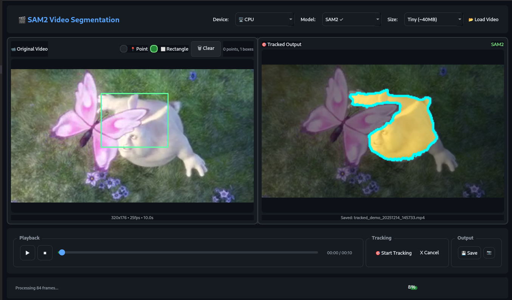

# SAM2 Video Segmentation & Tracking

Segment and track objects in videos using Meta's **SAM2** (Segment Anything Model 2).



## Features

- 🎯 **Object Tracking** - Select objects once, track through entire video
- 📍 **Point Selection** - Click to mark objects
- ⬜ **Rectangle Selection** - Draw bounding boxes
- 🧠 **Multiple Model Sizes** - Tiny, Small, Base+, Large
- 🖥️ **CPU/GPU Support** - Works on both CPU and NVIDIA GPU
- 👁️ **Live Preview** - See tracking results in real-time
- 💾 **Video Export** - Save tracked videos as MP4

## Installation

```bash
# 1. Install dependencies
pip install -r requirements.txt

# 2. Install SAM2
git clone https://github.com/facebookresearch/sam2.git
cd sam2 && pip install -e .
cd ..

# 3. Run application
python app.py
```

## Usage

1. **Load Video** - Click "Load Video" button
2. **Select Object**:
   - **Point mode**: Click on the object to track
   - **Rectangle mode**: Draw a box around the object
3. **Choose Settings**:
   - Device: CPU or GPU
   - Model: Demo or SAM2
   - Size: Tiny (fastest) → Large (most accurate)
4. **Start Tracking** - Click "Start Tracking"
5. **Save Result** - Click "Save" when done

## Project Structure

```
video_segmentation/
├── app.py                 # Application entry point
├── requirements.txt       # Python dependencies
├── README.md              # This file
├── images/                # Screenshots
│   └── p1.png
├── checkpoints/           # SAM2 model files (auto-downloaded)
├── output/                # Saved videos & screenshots
└── src/
    ├── config/
    │   ├── settings.py    # Configuration & model management
    │   └── styles.py      # UI theme/styling
    ├── core/
    │   └── segmentation.py  # SAM2 tracking algorithms
    ├── threads/
    │   └── segmentation_thread.py  # Background processing
    └── ui/
        ├── main_window.py  # Main application window
        └── widgets.py      # Video display widgets
```

## SAM2 Models

| Model | Size | Speed | Memory | Use Case |
|-------|------|-------|--------|----------|
| **Tiny** | ~40MB | ⚡ Fastest | Low | Quick previews |
| **Small** | ~185MB | Fast | Medium | General use |
| **Base+** | ~325MB | Medium | Medium | Better accuracy |
| **Large** | ~900MB | Slow | High | Best quality |

Models download automatically on first use.

## Controls

| Control | Action |
|---------|--------|
| 📂 Load Video | Open video file |
| 📍 Point | Click to add selection points |
| ⬜ Rectangle | Drag to draw bounding box |
| 🗑 Clear | Remove all selections |
| ▶ / ⏸ | Play/Pause video |
| ⏹ | Stop and reset to start |
| 🎯 Start Tracking | Begin segmentation |
| ✖ Cancel | Stop processing |
| 💾 Save | Export result video |
| 📷 Screenshot | Capture current view |

## Notes

- **CPU Mode**: Processes ~80 frames max for memory efficiency
- **GPU Mode**: Processes all frames (requires NVIDIA + CUDA)
- **Demo Mode**: Color-based tracking (no SAM2 required)

## Requirements

- Python 3.8+
- PyQt6
- OpenCV
- PyTorch
- SAM2 (from GitHub)

## License

MIT License

